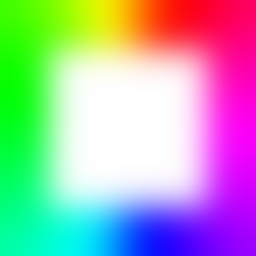

<h1 align="center">
  
   
   
  Ambilight
   
   
</h1>

<h3 align="center">
  Frame your screen with a rainbow inset.
</h3>

## Inspiration

This **r/SomebodyMakeThis** post:

- https://old.reddit.com/r/SomebodyMakeThis/comments/q46tih/an_rgb_strip_around_the_corner_of_windows_screen/

## Building

Requires the AutoHotKey script [freeze.ahk](freeze.ahk) to be compiled to `freeze.exe`.

## Running

Requires `freeze.exe` and [sciter.dll](https://github.com/c-smile/sciter-js-sdk/blob/b5c4d4efe4ed48fc96c7900c8e89e18c3c1c6397/bin/windows/x64/sciter.dll) to be in the same folder.